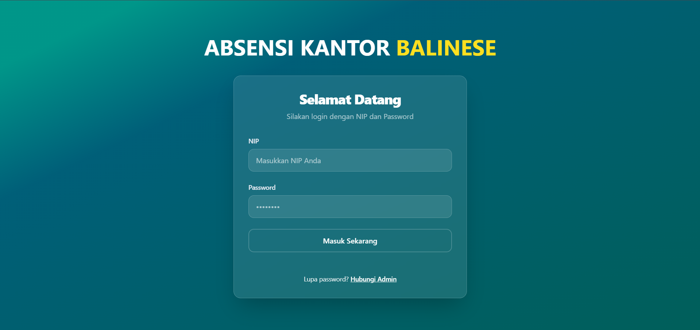
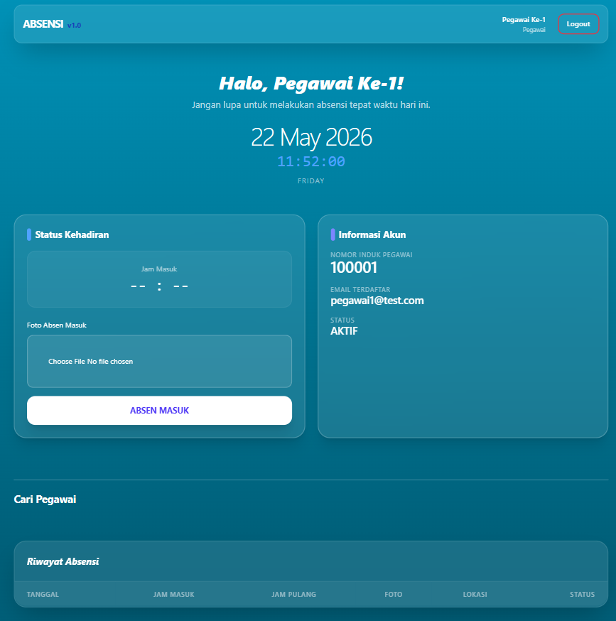

# Sistem Absensi Pegawai Kantor (Tugas Kuliah)

Aplikasi manajemen absensi pegawai berbasis web yang dibangun menggunakan **Laravel 11/13** dan database **MySQL**.

## Fitur Utama
* Sistem Autentikasi Login (Pegawai & Admin)
* Pencatatan Absensi Masuk & Keluar
* Fitur Tambahan (Foto Absen & Koordinat Lokasi)
* Halaman Dashboard Ringkasan Data

## Tampilan Website

## Cara Menjalankan Project Secara Lokal
1. Clone repository ini: `git clone https://github.com/Kedolce/Sistem_Absensi_Pegawai_Kantor`
2. Jalankan `composer install` dan `npm install && npm run dev`
3. Salin file `.env.example` menjadi `.env` lalu sesuaikan konfigurasi database MySQL Anda
4. Jalankan perintah `php artisan key:generate`
5. Jalankan migrasi database: `php artisan migrate --seed`
6. Jalankan server lokal: `php artisan serve`